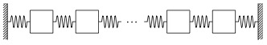

# System model

Consider an linear time-invariant system
$$
x_{t+1} = Ax_t + Bu_t,
$$

where $x_t\in\mathbb{R}^n,~u_t\in\mathbb{R}^m$ for $t\in\mathbb{Z}_+$, and $A\in\mathbb{R}^{n\times n},~B\in\mathbb{R}^{n\times m}$. The initial condition is $z_0$ and the maximum absolute value of the states and control inputs is bounded by $x_{\max}$ and $u_{\max}$, respectively, at all time instants.

## Oscillating masses



The system is composed of $m$ unit-masses connected by springs (with unit spring constant) in series, and to walls on either side (see the figure above). The control inputs are $m$ independent external forces applied on each mass. The state vector of the system consists of the one-dimensional position and velocity of each of masses i.e. $n = 2m$.

The system and input matrices for the continuous-time system are
$$
\begin{aligned}
A_c ={} & \left[\begin{array}{cc} \mathbf{0}_{m\times m} & I_{m} \\ \left[
    \begin{array}{cccccc} 
    -2 &  1 &  0 &     & \cdots & 0 \\ 
     1 & -2 &  1 &  0  & \cdots & 0 \\ 
     0 &  1 & -2 &  1  & \cdots & 0 \\
    \vdots &  & \ddots & \ddots & \ddots    & \vdots \\
     0 &  \cdots  &    &        &   1  & -2
    \end{array}\right] & \mathbf{0}_{m\times m} \end{array}\right],\\
B_c ={} & \left[\begin{array}{c} \mathbf{0}_{m\times m}\\I_{m}\end{array}\right].
\end{aligned}
$$
The system and input matrices for the corresponding discrete-time system with sampling time $T$ and zero-order hold on input can be written as
$$
\begin{aligned}
A ={} & e^{A_cT},\\
B ={} & A_c^{-1}\left( A - I_n \right)B_c.
\end{aligned}
$$

<!-- ## Neutrally stable random system

Entries of $A,B$ and $z_0$ are sampled from the standard normal distribution. Matrix $A$ is normalized by the spectral radius to ensure that the system is neutrally stable, and entries of $z_0$ are saturated to lie in the interval $[-x_{\max},x_{\max}]$.

```matlab
A = randn(n);
% Scale by spectral radius to create a neutrally stable system
A = A/max(abs(eig(A)));

B = randn(n,m);
``` -->

# Regulation to origin

## Discrete-time optimal control problem

$$
\begin{aligned}
\underset{\genfrac{}{}{0pt}{1}{u_t,~t=0,\ldots,N-1}{x_t,~t=0,\ldots,N}}{\text{minimize}} &~~\frac{1}{2}x_N^\top Q x_N +\frac{1}{2}\sum_{t=0}^{N-1}x_{t}^\top Q x_t + u_t^\top R u_t & & \\
\text{subject to} &~~x_{t+1} = Ax_t + Bu_t, & & t=0,\ldots,N-1,\\
 &~~ \|x_t\|_\infty \le x_{\max}, & & t = 1,\ldots,N-1,\\
 &~~ \|u_t\|_\infty \le u_{\max}, & & t = 0,\ldots,N-1,\\
 &~~ x_0 = z_0, & & \\
 &~~ x_N = \mathbf{0}_n. & &   
\end{aligned}
$$

## Conversion to quadratic program

$$
\begin{aligned}
\text{minimize} ~& ~\frac{1}{2}\xi^\top P \xi\\
\text{subject to} & ~H\xi - g = \mathbf{0}_{nN},\\
& \xi_{\min} \le \xi \le \xi_{\max},
\end{aligned}
$$
where
$$
\begin{aligned}
\xi ={}& \left[\begin{array}{c} u_0\\ \vdots \\ u_{N-1}\\ x_0 \\ \vdots \\ x_N  \end{array}\right],\\
P ={}& \left[\begin{array}{cc} I_N \otimes R & \mathbf{0}_{mN\times n(N+1)} \\ \mathbf{0}_{n(N+1)\times mN} & I_{N+1} \otimes Q\end{array}\right],\\
H ={}&\left[H_u~~H_x\right],~~H_u = I_N\otimes B,~~H_x = \left[ I_N\otimes A~~\mathbf{0}_{nN\times n} \right] - \left[\mathbf{0}_{nN\times n}~~I_{nN}\right],\\ 
g ={}& \mathbf{0}_{nN},\\
\xi_{\min} ={}&\left[\begin{array}{c}-\mathbf{1}_{mN}\otimes u_{\max}\\z_0\\-\mathbf{1}_{nN-n}\otimes x_{\max}\\\mathbf{0}_{n}\end{array}\right],~~\xi_{\max} = \left[\begin{array}{c}\mathbf{1}_{mN}\otimes u_{\max}\\z_0\\\mathbf{1}_{nN-n}\otimes x_{\max}\\\mathbf{0}_{n}\end{array}\right].
\end{aligned}
$$

# Infeasibility detection in exPIPG
**Yue Yu, 04/30/2022**

We wish to obtain a infeasibility certificate $\overline{\eta}\in\mathbb{R}^m$ such that
$$
    \inf_{\xi\in\mathbb{D}}\,\langle H\xi-g, \overline{\eta}\rangle>\sup_{\eta\in\mathbb{K}}\,\langle \eta, \overline{\eta}\rangle.
$$
If $\mathbb{K}=\{0_m\}$ and $\mathbb{D}=\{\xi\,|\,\xi_{\min}\leq \xi\leq \xi_{\max}\}\subset\mathbb{R}^n$, we have
$$
    \sup_{\eta\in\mathbb{K}}\,\langle \eta, \overline{\eta}\rangle=0.
$$
and 
$$
    \begin{aligned}
    &\inf_{\xi \in\mathbb{D}}\,\langle H\xi-g, \overline{\eta}\rangle\\
    &=-\langle g, \overline{\eta}\rangle +\inf_{\xi\in\mathbb{D}}\,\langle H^\top \overline{\eta}, \xi\rangle\\
    &=-\langle g, \overline{\eta}\rangle+\langle H^\top \overline{\eta}, \overline{\xi}\rangle
    \end{aligned}
$$
where 
$$
    \big[\overline{\xi}\big]_i=\begin{cases}
    [\xi_{\min}]_i, & \big[H^\top \overline{\eta}\big]_i\geq 0,\\
    [\xi_{\max}]_i, & \big[H^\top \overline{\eta}\big]_i< 0,
    \end{cases}
$$
for $i = 1,\ldots,n$.

The intuition is that, when minimizing a scalar-to-scalar linear function over an interval, the minimum is attained at either left or right boundary of the interval, depends on whether the linear function has positive or negative slope.

We can define $\overline{\xi}$ compactly as follows:
$$
    \overline{\xi}=(H^\top \overline{\eta}\geq 0) \odot \xi_{\min}+(H^\top \overline{\eta}< 0) \odot \xi_{\max}
$$
where $\odot$ denotes element-wise product.

An *$\epsilon$-approximate infeasibility certificate* is hence given by $\overline{w}$ such that
$$
    \inf_{\xi\in\mathbb{D}}\,\langle H\xi-g, \overline{\eta}\rangle> -\epsilon, 
$$
which is equivalent to the following
$$
    \langle H\overline{\xi}-g, \overline{\eta}\rangle>-\epsilon
$$
In exPIPG, we let $\overline{\eta}=\eta^{k+1}-\eta^k$ and test if the above condition holds; if so, we terminate and declare the optimization infeasible.

## Devectorization of detection criteria
$$
\begin{aligned}
    \overline{x}_t ={}& \left\{\begin{array}{lll} z_0, & t=0,\\
    \big(\overline{w}_{t-1} - A^\top \overline{w}_t \ge 0 \big)\odot x_{\min} + \big( \overline{w}_{t-1} - A^\top \overline{w}_t < 0  \big)\odot x_{\max}, &t=1,\ldots,N-1,\\
    z_N,& t=N, \end{array}\right.\\
    \overline{u}_t ={}& \big(-B^\top \overline{w}_t \ge 0 \big)\odot u_{\min} + \big( -B^\top \overline{w}_t < 0 \big)\odot u_{\max},\quad~~~~~~~ t = 0,\ldots,N-1. 
\end{aligned}
$$


*$\epsilon$-approximate infeasibility certificate*
$$
\begin{aligned}
\sum_{t=0}^{N-1}\overline{w}_t^\top\big(\overline{x}_{t+1} - A\overline{x}_t - B\overline{u}_t\big)>-\epsilon
\end{aligned}
$$

# Implementation notes

| | |
|:-|:-|
|`Primal error:`|$\|\xi^{k+1} - \xi^k\|_\infty$| 
|`Dual error:`|$\|\eta^{k+1}-\eta^k\|_\infty$|
|`Infeas. cert.:` | $\langle H\overline{\xi} - g,\overline{\eta} \rangle$|

Infeasibility detection criteria based on ratio dual variable error
$$
\left| \frac{\|w^{k+1+M}-w^{k+M}\|_\infty}{\|w^{k+1}-w^{k}\|_\infty} - 1 \right| \le \epsilon,
$$
where $M$ is the frequency at which the above criteria is tested. This criteria is denoted by `old_infeas` and is implemented in

  - `expipg_vec.m` 
  - `expipg_vec_mex.mexmaci64`
  - `expipg_dvec.m`
  - `expipg_dvec_mex.mexmaci64`

The new infeasibility detection criteria developed by Yue Yu on 04/30/2022 (described in [section above](#infeasibility-detection-in-expipg)) 

$$
    \langle H\overline{\xi} - g,\overline{\eta} \rangle \ge \epsilon
$$

This criteria is denoted by `new_infeas` and is implemented in

  - `expipg_vec_v2.m` 
  - `expipg_vec_v2_mex.mexmaci64`
  - `expipg_dvec_v2.m`
  - `expipg_dvec_v2_mex.mexmaci64`